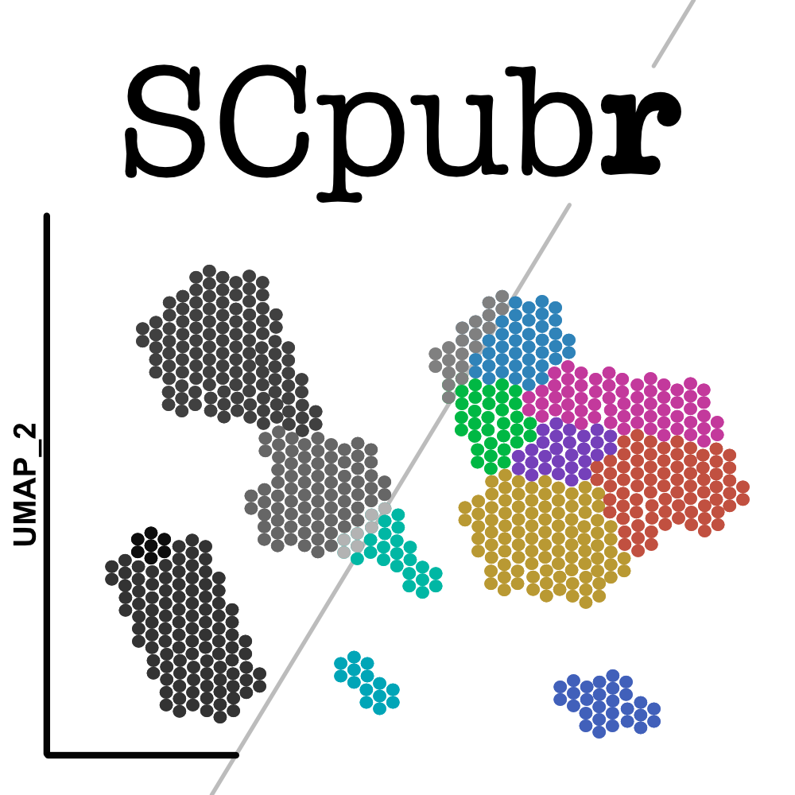

<!-- badges: start -->

<!-- badges: end -->
  
# SCpubr

Collection of functions aimed to streamline quality figure generation for Single Cell transcriptomics experiments.

For installation and tutorials, please use the [reference manual](https://enblacar.github.io/SCpubr/).

## Contact
e.blancocarmona@kitz-heidelberg.de
